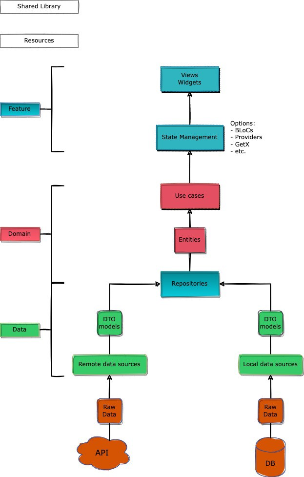

## Modularization Structure 🔥

    # Root Project
    .
    ├── domains                # Name of directory
    |   ├── domain A           # Domains module with a data and domains layer inside it.
    |   ├── domain B
    |   └── domain etc
    |
    ├── features               # Name of directory
    |   ├── feature A          # Feature module with a presentation/ui/feature layer inside it.
    |   ├── feature B
    |   └── feature etc
    |
    ├── lib                    # Name of module (default from Flutter)
    |
    └── resources              # Name of directory
    |       └── resources      # Handle resources like assets, fonts, constant value, etc.
    |
    └── shared_libraries       # Name of directory
        ├── common             # Handle common utility class.
        ├── component          # Handle custom widget.
        ├── core               # Core module.
        └── dependencies       # Handle dependency version updates.

## Clean Architecture Flow (Feature Module) 🔥
<pre>

</pre>

## Built With 🛠
* [Modularization](https://medium.com/flutter-community/mastering-flutter-modularization-in-several-ways-f5bced19101a) - Separate functionality into independent, interchangeable modules.
* [Clean Architecture](https://medium.com/ruangguru/an-introduction-to-flutter-clean-architecture-ae00154001b0) - The blueprint for a modular system, which strictly follows the design principle called separation of concerns.
* [Dependency Injection (get_it)](https://pub.dev/packages/get_it) - Simple direct Service Locator that allows to decouple the interface from a concrete implementation and to access the concrete implementation from everywhere in your App.
* [State Management (BLoC)](https://bloclibrary.dev/) - Business logic component to separate the business logic with UI.
* [Dio](https://github.com/flutterchina/dio/) - A type-safe HTTP client.
* [Melos](https://pub.dev/packages/melos) - A tool for managing Dart & Flutter repositories with multiple packages (monorepo).

## Requirements 🛠
* Flutter SDK Version: 2.10.0
* Dart SDK Version: 2.16.0

## Step By Step Run This Project
* Clone this project
* Install [Melos](https://pub.dev/packages/melos).
* Running **melos bootstrap** from your terminal.
* Enjoy

## Author

* **R Rifa Fauzi Komara**

Don't forget to follow me, fork and give me a ⭐
